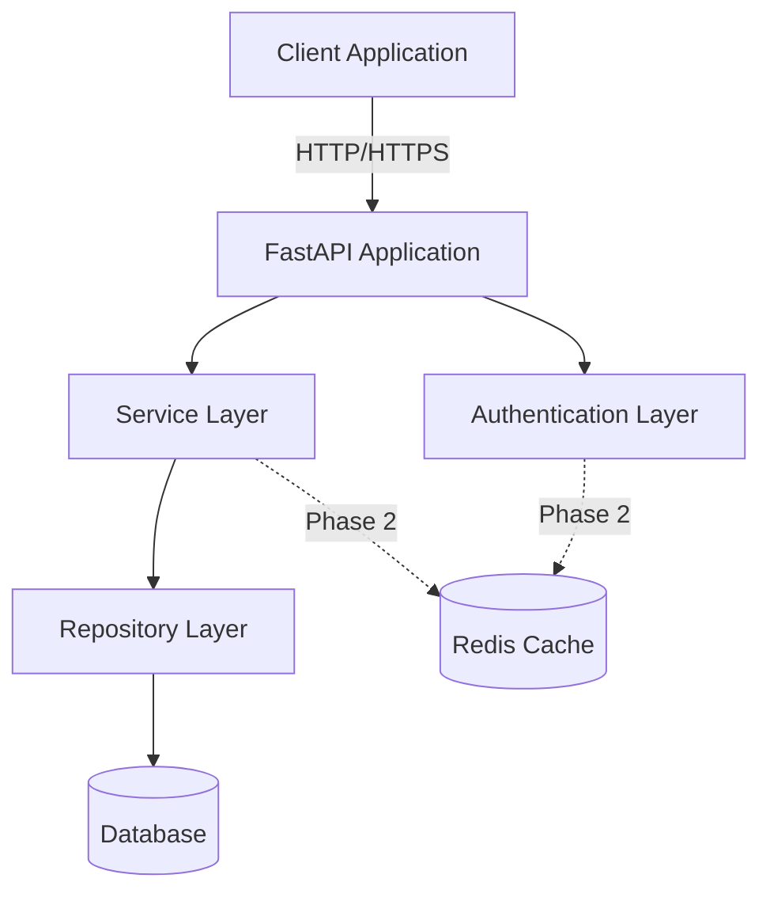
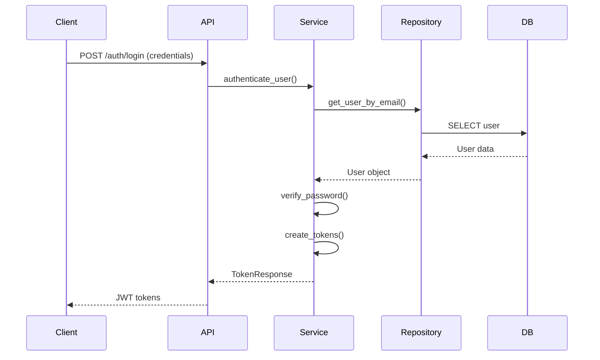

# System Architecture - FastAPI Enterprise Baseline

**Document Version**: 1.0.0  
**Last Updated**: 2025-01-25  
**Status**: Living Document

## Architecture Overview



## Architectural Principles

### 1. Separation of Concerns
Each layer has a single, well-defined responsibility:
- **API Layer**: HTTP handling, request/response transformation
- **Service Layer**: Business logic, orchestration
- **Repository Layer**: Data access, query building
- **Model Layer**: Data structure definitions

### 2. Dependency Inversion
- Higher layers depend on abstractions, not concrete implementations
- Dependency injection for loose coupling
- Testability through interface design

### 3. Async-First Design
- Async/await throughout the stack
- Non-blocking I/O operations
- Efficient resource utilization

### 4. Domain-Driven Design
- Business logic in service layer
- Domain models separate from database models
- Rich domain objects with behavior

## Layer Architecture

### API Layer (Presentation)

**Responsibilities:**
- HTTP request handling
- Input validation
- Response formatting
- Authentication/authorization
- Error handling
- API documentation

**Key Components:**
```python
app/api/
├── dependencies.py  # Shared dependencies
├── v1/
│   ├── api.py      # Router aggregation
│   └── endpoints/  # Endpoint modules
│       ├── auth.py
│       ├── health.py
│       └── users.py
```

**Design Patterns:**
- Router pattern for endpoint organization
- Dependency injection for services
- Middleware pipeline for cross-cutting concerns

### Service Layer (Business Logic)

**Responsibilities:**
- Business rule implementation
- Transaction coordination
- External service integration
- Complex validations
- Business event handling

**Key Components:**
```python
app/services/
├── __init__.py
├── base.py      # Base service class
├── auth.py      # Authentication service
├── user.py      # User management service
└── oauth/       # OAuth provider services
    ├── base.py
    ├── google.py
    └── factory.py
```

**Design Patterns:**
- Service pattern for business logic
- Factory pattern for OAuth providers
- Strategy pattern for authentication methods

### Repository Layer (Data Access)

**Responsibilities:**
- Database queries
- Data persistence
- Query optimization
- Transaction management
- Cache integration (Phase 2)

**Key Components:**
```python
app/repositories/
├── __init__.py
├── base.py      # Generic repository
└── user.py      # User repository
```

**Design Patterns:**
- Repository pattern for data access
- Generic repository for CRUD operations
- Unit of Work via SQLAlchemy sessions

### Model Layer (Domain & Data)

**Responsibilities:**
- Domain entity definitions
- Data validation rules
- Database schema mapping
- Serialization/deserialization

**Key Components:**
```python
app/models/      # SQLAlchemy models
├── __init__.py
├── base.py      # Base model class
└── user.py      # User model

app/schemas/     # Pydantic schemas
├── __init__.py
├── user.py      # User schemas
├── oauth.py     # OAuth schemas
└── pagination.py # Pagination schemas
```

**Design Patterns:**
- Active Record pattern (SQLAlchemy)
- Data Transfer Objects (Pydantic)
- Schema versioning for API evolution

## Core Design Patterns

### 1. Repository Pattern

```python
class BaseRepository(Generic[ModelType]):
    def __init__(self, model: Type[ModelType], session: AsyncSession):
        self.model = model
        self.session = session
    
    async def get(self, id: Any) -> Optional[ModelType]:
        # Generic get implementation
    
    async def create(self, obj_in: Dict[str, Any]) -> ModelType:
        # Generic create implementation
```

**Benefits:**
- Abstracts data access logic
- Enables easy testing with mocks
- Supports multiple data sources
- Centralizes query logic

### 2. Service Pattern

```python
class UserService:
    def __init__(self, session: AsyncSession):
        self.session = session
        self.repository = UserRepository(session)
    
    async def create_user(self, user_data: UserCreate) -> User:
        # Business logic here
        # Validation
        # Repository call
        # Event emission
```

**Benefits:**
- Encapsulates business logic
- Coordinates multiple repositories
- Handles complex transactions
- Provides high-level API

### 3. Dependency Injection

```python
async def get_user_service(
    session: AsyncSession = Depends(get_async_db)
) -> UserService:
    return UserService(session)

@router.get("/users/{user_id}")
async def get_user(
    user_id: int,
    service: UserService = Depends(get_user_service)
):
    return await service.get_user(user_id)
```

**Benefits:**
- Loose coupling between components
- Easy testing with mock dependencies
- Configuration flexibility
- Lifecycle management

### 4. Factory Pattern (OAuth)

```python
class OAuthProviderFactory:
    @staticmethod
    def create_provider(provider_name: str) -> BaseOAuthProvider:
        if provider_name == "google":
            return GoogleOAuthProvider()
        # Add more providers
        raise ValueError(f"Unknown provider: {provider_name}")
```

**Benefits:**
- Extensible provider system
- Consistent interface
- Easy to add new providers
- Runtime provider selection

## Database Architecture

### Connection Management

```python
# Async engine with connection pooling
engine = create_async_engine(
    DATABASE_URL,
    pool_size=20,
    max_overflow=30,
    pool_pre_ping=True,
    pool_recycle=3600
)
```

### Session Lifecycle

```python
async def get_async_db() -> AsyncGenerator[AsyncSession, None]:
    async with AsyncSessionLocal() as session:
        try:
            yield session
        except Exception:
            await session.rollback()
            raise
        finally:
            await session.close()
```

### Migration Strategy
- Alembic for schema migrations
- Auto-generation from models
- Rollback capability
- Version control for schemas

## Security Architecture

### Authentication Flow



### Token Architecture
- **Access Token**: Short-lived (30 min), contains user claims
- **Refresh Token**: Long-lived (7 days), for token renewal
- **JWT Structure**: Header.Payload.Signature
- **Claims**: sub, email, exp, iat, iss, aud

### Security Layers
1. **Transport**: HTTPS enforcement
2. **Authentication**: JWT tokens, OAuth2
3. **Authorization**: Role-based access control (future)
4. **Validation**: Input sanitization via Pydantic
5. **Database**: Parameterized queries via SQLAlchemy

## Caching Architecture (Phase 2)

### Cache Layers
1. **Application Cache**: FastAPI response caching
2. **Query Cache**: Database query results
3. **Session Cache**: User session data
4. **Token Cache**: JWT token validation

### Cache Strategy
```python
# Decorator-based caching
@cache(expire=300)
async def get_user(user_id: int):
    # Expensive operation cached for 5 minutes
```

## Error Handling Architecture

### Exception Hierarchy
```python
APIException
├── ValidationError (400)
├── AuthenticationError (401)
├── AuthorizationError (403)
├── NotFoundError (404)
├── ConflictError (409)
└── InternalError (500)
```

### Global Error Handler
```python
@app.exception_handler(APIException)
async def api_exception_handler(request: Request, exc: APIException):
    return JSONResponse(
        status_code=exc.status_code,
        content={
            "error": exc.message,
            "details": exc.details,
            "request_id": request.state.request_id
        }
    )
```

## Monitoring Architecture (Phase 2)

### Metrics Collection
- **Prometheus**: Time-series metrics
- **OpenTelemetry**: Distributed tracing
- **Custom Metrics**: Business KPIs

### Logging Strategy
- **Structured Logging**: JSON format
- **Correlation IDs**: Request tracking
- **Log Levels**: DEBUG, INFO, WARNING, ERROR
- **Aggregation**: Centralized log management

## Deployment Architecture

### Container Strategy
```dockerfile
# Multi-stage build
FROM python:3.12-slim as builder
# Build dependencies

FROM python:3.12-slim
# Runtime only
```

### Environment Configuration
- **Development**: Local SQLite, debug enabled
- **Staging**: PostgreSQL, production-like
- **Production**: PostgreSQL, optimized, monitoring

### Scaling Strategy
- **Horizontal**: Multiple API instances
- **Load Balancing**: Nginx/HAProxy
- **Database**: Read replicas (future)
- **Caching**: Redis cluster (future)

## Technology Decisions

### Why FastAPI?
- Modern async framework
- Automatic OpenAPI documentation
- Type safety with Pydantic
- High performance
- Great developer experience

### Why SQLAlchemy 2.0?
- Mature ORM with async support
- Type hints support
- Powerful query capabilities
- Migration support via Alembic
- Multiple database support

### Why Pydantic?
- Runtime type validation
- Serialization/deserialization
- OpenAPI schema generation
- Custom validators
- Performance optimizations

### Why Repository Pattern?
- Testability
- Abstraction of data access
- Centralized query logic
- Easy to switch data sources
- Query optimization

## Future Architecture Enhancements

### Phase 2: Enterprise Features
- Redis caching layer
- Rate limiting middleware
- Monitoring integration
- Background job processing

### Phase 3: Advanced Features
- WebSocket support
- GraphQL endpoint
- Event-driven architecture
- Microservices ready

### Phase 4: Scale & Performance
- Database sharding
- Read/write splitting
- CDN integration
- Auto-scaling

---

**Document Status**: Living Document  
**Review Schedule**: Updated with each architectural decision  
**Next Update**: After Phase 1 implementation