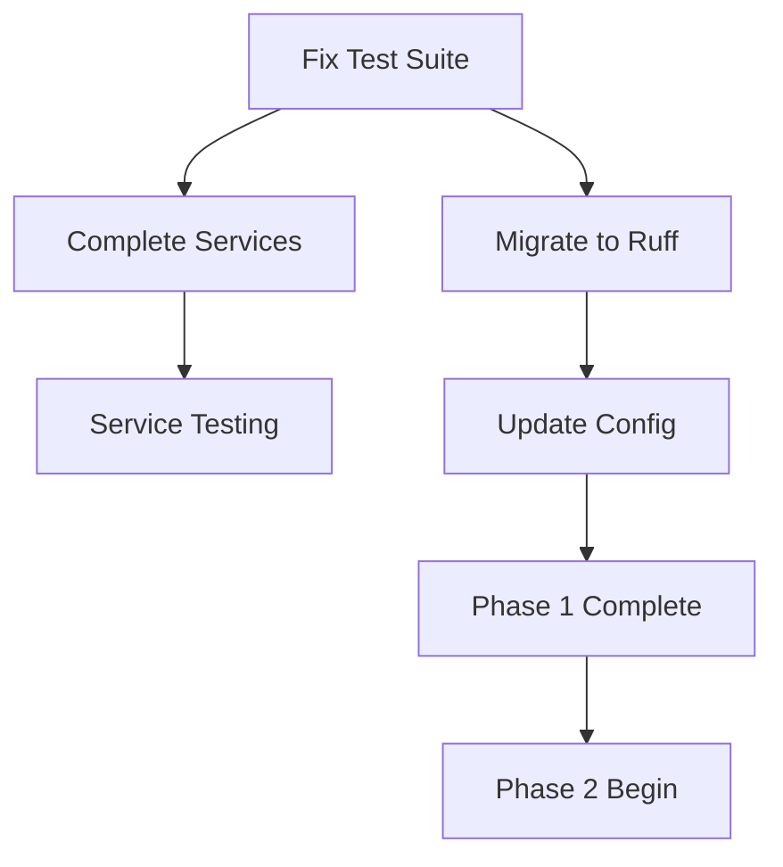

# Task Tracking - FastAPI Enterprise Baseline

**Document Version**: 1.0.0  
**Last Updated**: 2025-01-25  
**Current Phase**: Phase 1 - Critical Fixes

## Current Sprint: Phase 1 Implementation

### Active Tasks

#### 1. Create Documentation Structure ✅ COMPLETED
- [x] Create `docs/ai/` directory
- [x] Write `improvement-plan.md` - Comprehensive project roadmap
- [x] Write `spec.md` - Technical specifications and requirements
- [x] Write `architecture.md` - System architecture and design patterns
- [x] Write `todo.md` - This task tracking document
- [x] Write `actions.md` - Log of changes and decisions
- [x] Write `lessons.md` - Insights and best practices

**Status**: 100% Complete ✅
**Completed**: 2025-01-25

#### 2. Fix Test Suite Configuration and Imports ⚠️ PENDING
**Priority**: Critical  
**Estimated Effort**: 4-6 hours

**Sub-tasks**:
- [ ] Analyze failing tests (138/138 failing)
- [ ] Fix import issues in test files
- [ ] Update pytest configuration in pyproject.toml
- [ ] Fix async test configuration in conftest.py
- [ ] Ensure proper database isolation between tests
- [ ] Verify all fixtures are properly configured
- [ ] Run tests to verify 100% passing

**Dependencies**: None  
**Blocking**: All other development work

#### 3. Complete Core Service Implementations ⚠️ PENDING
**Priority**: High  
**Estimated Effort**: 6-8 hours

**Sub-tasks**:
- [ ] Review UserService (currently 19% coverage)
- [ ] Implement missing methods in app/services/user.py
- [ ] Create app/services/auth.py for authentication logic
- [ ] Add comprehensive docstrings to all service methods
- [ ] Add proper error handling and validation
- [ ] Follow UserService pattern for consistency
- [ ] Achieve >80% coverage in service layer

**Dependencies**: Test suite must be fixed first  
**Blocking**: Service layer testing

#### 4. Migrate to Ruff Tooling 🔄 In Progress
**Priority**: Medium  
**Estimated Effort**: 2-3 hours

**Sub-tasks**:
- [x] Install ruff via uv
- [x] Configure ruff in pyproject.toml
- [x] Remove black, isort, flake8, mypy configurations
- [x] Update lint script to use ruff
- [ ] Update pre-commit hooks to use ruff
- [ ] Update CI/CD workflows if present
- [x] Update documentation/README commands

**Dependencies**: None  
**Blocking**: Code quality enforcement

#### 5. Update Project Configuration 🔄 In Progress
**Priority**: Low  
**Estimated Effort**: 1-2 hours

**Sub-tasks**:
- [x] Update Python target version to 3.12 in tooling (Dockerfile, docs)
- [ ] Update type hints to use modern Python 3.12+ syntax
- [x] Review and update dependencies to latest stable versions (remove legacy tooling)
- [ ] Configure proper async mode for testing
- [x] Update README with new requirements

**Dependencies**: Ruff migration  
**Blocking**: None

## Completed Tasks

### ✅ Documentation Reorganization (2025-01-25)
- Merged architecture_old.md content into architecture.md
- Deleted redundant documentation files (oauth2-consolidation-summary.md, oauth2-integration.md)
- Updated README.md with correct OAuth endpoint paths
- Updated spec.md authentication flow to match implementation
- Created feature documentation index at docs/features/README.md
- Updated all documentation to reflect current codebase state

### ✅ Documentation Foundation (2025-01-25)
- Created comprehensive project documentation structure
- Established living document pattern
- Set up tracking and decision logging framework

## Upcoming Tasks (Phase 2)

### Enterprise Features Implementation
**Start Date**: After Phase 1 completion  
**Priority**: High

#### Rate Limiting Implementation
- [ ] Install slowapi dependency
- [ ] Create RateLimitingMiddleware
- [ ] Configure per-endpoint limits
- [ ] Add Redis backend for distributed limiting
- [ ] Add rate limit error handling

#### Caching Layer
- [ ] Install FastAPI-cache and Redis
- [ ] Create caching decorators
- [ ] Implement query result caching
- [ ] Add cache invalidation strategies
- [ ] Monitor cache hit rates

#### Monitoring Integration
- [ ] Install Prometheus and OpenTelemetry
- [ ] Add metrics collection
- [ ] Implement distributed tracing
- [ ] Create custom business metrics
- [ ] Set up alerting rules

## Blocked Tasks

None currently.

## Deferred Tasks

### OAuth Credentials Security
**Original Issue**: Google OAuth credentials in .env  
**Decision**: Defer to Phase 2 when implementing secrets management  
**Reason**: User requested to keep current setup for now

## Task Dependencies Graph

## Metrics and Goals

### Phase 1 Success Criteria
- [ ] All tests passing (currently 0/138)
- [ ] Service layer coverage >80% (currently 19%)
- [ ] Modern tooling configured (ruff)
- [ ] Python 3.12 features utilized
- [ ] Documentation complete and current

### Time Tracking
- **Phase 1 Start**: 2025-01-25
- **Target Completion**: End of Week 1
- **Time Spent**: 2 hours (documentation)
- **Remaining Estimate**: 12-16 hours

### Risk Assessment
- **High Risk**: Test suite complexity may require more time than estimated
- **Medium Risk**: Service implementations may reveal architectural issues
- **Low Risk**: Ruff migration should be straightforward

## Daily Standup Format

### What was completed yesterday?
- Created comprehensive documentation structure
- Established project specifications and architecture

### What will be worked on today?
- Complete documentation (actions.md, lessons.md)
- Begin test suite analysis and fixes

### What blockers exist?
- None currently identified

## Notes and Decisions

### Decision Log
1. **Documentation First Approach**: Decided to create comprehensive docs before implementation to ensure proper tracking and decision recording per CLAUDE.md requirements.

2. **Test Suite Priority**: Made fixing tests the highest priority since all development depends on having a working test suite.

3. **Ruff Migration**: Chosen over incremental tooling updates based on expert recommendations for 10-100x performance improvement.

### Lessons Learned
1. **Documentation Value**: Creating comprehensive docs upfront provides clarity on scope and dependencies.
2. **Phase Planning**: Breaking work into clear phases helps manage complexity.

---

**Document Status**: Active  
**Update Frequency**: Daily during active development  
**Review Schedule**: Weekly or at phase completion
