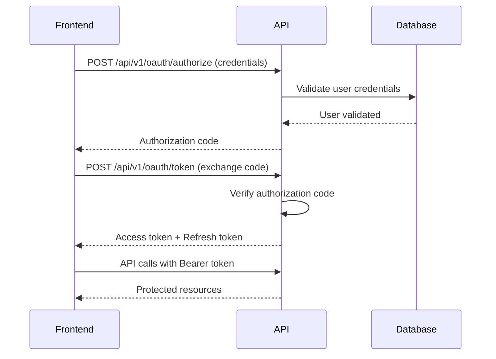
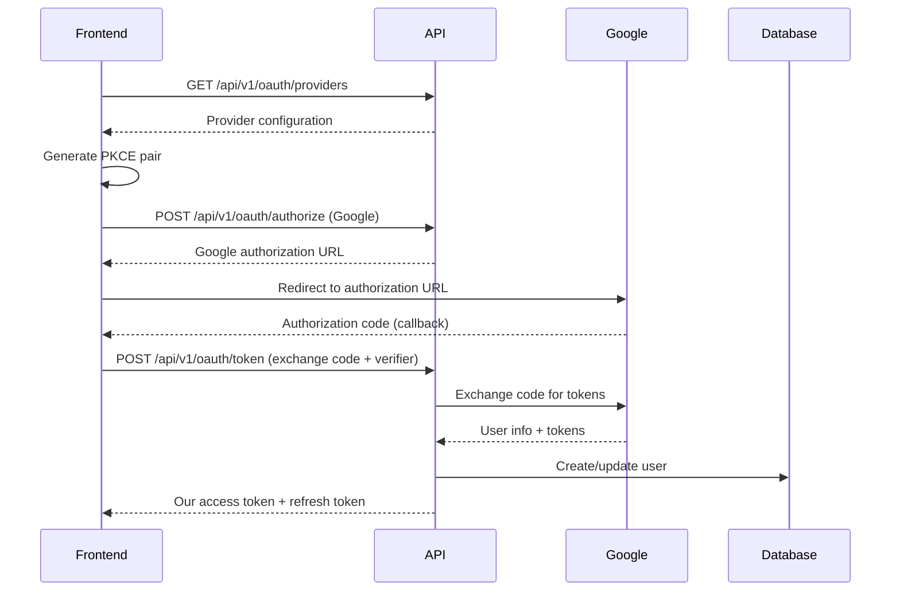

# OAuth2 Integration Guide

This guide provides comprehensive documentation for integrating with the OAuth2-compliant authentication system, specifically designed for frontend applications using modern Single Page Application (SPA) patterns.

## Overview

Our OAuth2 implementation supports:
- **Local Account Authentication**: Traditional email/password authentication with OAuth2-compliant JWT tokens
- **External OAuth Providers**: Google OAuth2 integration (extensible to other providers)
- **PKCE (Proof Key for Code Exchange)**: Enhanced security for public clients
- **Token Refresh**: Automatic token renewal without re-authentication
- **Frontend-Friendly**: Designed specifically for React, Vue.js, Angular, and other SPA frameworks

## Authentication Flows

### 1. Local Account OAuth2 Flow

For users with local accounts (email/password), we provide an OAuth2-compliant flow:



### 2. External OAuth Provider Flow (Google)

For OAuth providers like Google, we implement the standard Authorization Code flow with PKCE:



## API Endpoints

### 1. Get OAuth Providers

Get list of available authentication providers and their configuration.

```http
GET /api/v1/oauth/providers
```

**Response:**
```json
{
  "providers": [
    {
      "name": "local",
      "display_name": "Local Account",
      "type": "local",
      "supports_pkce": true
    },
    {
      "name": "google",
      "display_name": "Google",
      "type": "oauth2",
      "supports_pkce": true,
      "authorization_url": "https://accounts.google.com/o/oauth2/v2/auth",
      "scopes": ["openid", "email", "profile"]
    }
  ],
  "recommended_flow": "authorization_code_with_pkce",
  "pkce_required": true
}
```

### 2. Authorization Endpoint

Initiate OAuth2 authorization flow.

```http
POST /api/v1/oauth/authorize
Content-Type: application/json
```

**Request Body (Local Provider):**
```json
{
  "provider": "local",
  "client_id": "your-frontend-app",
  "redirect_uri": "http://localhost:3000/auth/callback",
  "state": "random-state-string",
  "username": "user@example.com",
  "password": "user-password"
}
```

**Request Body (External Provider):**
```json
{
  "provider": "google",
  "client_id": "your-google-client-id",
  "redirect_uri": "http://localhost:3000/auth/callback",
  "state": "random-state-string",
  "scope": "openid email profile",
  "code_challenge": "generated-pkce-challenge",
  "code_challenge_method": "S256"
}
```

**Response (Local Provider):**
```json
{
  "authorization_code": "eyJ0eXAiOiJKV1QiLCJhbGciOiJIUzI1NiJ9...",
  "state": "random-state-string",
  "redirect_uri": "http://localhost:3000/auth/callback",
  "code_verifier": null
}
```

**Response (External Provider):**
```json
{
  "authorization_url": "https://accounts.google.com/o/oauth2/v2/auth?client_id=...",
  "state": "random-state-string",
  "redirect_uri": "http://localhost:3000/auth/callback",
  "code_verifier": null
}
```

### 3. Token Exchange Endpoint

Exchange authorization code for access and refresh tokens.

```http
POST /api/v1/oauth/token
Content-Type: application/json
```

**Request Body:**
```json
{
  "provider": "local",
  "grant_type": "authorization_code",
  "code": "authorization-code-from-previous-step",
  "redirect_uri": "http://localhost:3000/auth/callback",
  "client_id": "your-frontend-app",
  "code_verifier": "pkce-code-verifier-if-applicable"
}
```

**Response:**
```json
{
  "access_token": "eyJ0eXAiOiJKV1QiLCJhbGciOiJIUzI1NiJ9...",
  "token_type": "Bearer",
  "expires_in": 1800,
  "refresh_token": "eyJ0eXAiOiJKV1QiLCJhbGciOiJIUzI1NiJ9...",
  "scope": "openid email profile"
}
```

### 4. Direct Local Login (Simplified)

Alternative endpoint for local accounts that skips the authorization code step.

```http
POST /api/v1/oauth/login
Content-Type: application/json
```

**Request Body:**
```json
{
  "email": "user@example.com",
  "password": "user-password"
}
```

**Response:**
```json
{
  "access_token": "eyJ0eXAiOiJKV1QiLCJhbGciOiJIUzI1NiJ9...",
  "token_type": "Bearer",
  "expires_in": 1800,
  "refresh_token": "eyJ0eXAiOiJKV1QiLCJhbGciOiJIUzI1NiJ9...",
  "scope": "openid email profile"
}
```

### 5. Refresh Token Endpoint

Refresh access token using refresh token.

```http
POST /api/v1/oauth/refresh
Content-Type: application/json
```

**Request Body:**
```json
{
  "grant_type": "refresh_token",
  "refresh_token": "eyJ0eXAiOiJKV1QiLCJhbGciOiJIUzI1NiJ9..."
}
```

**Response:**
```json
{
  "access_token": "eyJ0eXAiOiJKV1QiLCJhbGciOiJIUzI1NiJ9...",
  "token_type": "Bearer",
  "expires_in": 1800,
  "refresh_token": "eyJ0eXAiOiJKV1QiLCJhbGciOiJIUzI1NiJ9...",
  "scope": "openid email profile"
}
```

### 6. Token Revocation

Revoke an access or refresh token.

```http
POST /api/v1/oauth/revoke
Content-Type: application/json
```

**Request Body:**
```json
{
  "token": "token-to-revoke"
}
```

**Response:**
```json
{
  "message": "Token revoked successfully"
}
```

## Frontend Integration Examples

### React with Axios

```javascript
// OAuth2Client.js
import axios from 'axios';

class OAuth2Client {
  constructor(baseURL, clientId) {
    this.baseURL = baseURL;
    this.clientId = clientId;
    this.accessToken = localStorage.getItem('access_token');
    this.refreshToken = localStorage.getItem('refresh_token');
    
    // Setup axios interceptor for automatic token refresh
    this.setupInterceptors();
  }

  // Generate PKCE pair for secure OAuth flows
  generatePKCE() {
    const codeVerifier = this.generateCodeVerifier();
    const codeChallenge = this.generateCodeChallenge(codeVerifier);
    return { codeVerifier, codeChallenge };
  }

  generateCodeVerifier() {
    const array = new Uint8Array(32);
    crypto.getRandomValues(array);
    return btoa(String.fromCharCode.apply(null, array))
      .replace(/\+/g, '-')
      .replace(/\//g, '_')
      .replace(/=/g, '');
  }

  async generateCodeChallenge(verifier) {
    const encoder = new TextEncoder();
    const data = encoder.encode(verifier);
    const digest = await crypto.subtle.digest('SHA-256', data);
    return btoa(String.fromCharCode.apply(null, new Uint8Array(digest)))
      .replace(/\+/g, '-')
      .replace(/\//g, '_')
      .replace(/=/g, '');
  }

  // Local account login (simplified flow)
  async loginLocal(email, password) {
    try {
      const response = await axios.post(`${this.baseURL}/oauth/login`, {
        email,
        password
      });

      this.setTokens(response.data.access_token, response.data.refresh_token);
      return response.data;
    } catch (error) {
      throw new Error(error.response?.data?.detail || 'Login failed');
    }
  }

  // OAuth2 flow for external providers
  async startOAuthFlow(provider) {
    const state = this.generateState();
    const { codeVerifier, codeChallenge } = this.generatePKCE();
    
    // Store PKCE verifier and state for later use
    sessionStorage.setItem('oauth_code_verifier', codeVerifier);
    sessionStorage.setItem('oauth_state', state);

    const authRequest = {
      provider,
      client_id: this.clientId,
      redirect_uri: `${window.location.origin}/auth/callback`,
      state,
      scope: 'openid email profile',
      code_challenge: codeChallenge,
      code_challenge_method: 'S256'
    };

    const response = await axios.post(`${this.baseURL}/oauth/authorize`, authRequest);
    
    if (response.data.authorization_url) {
      // Redirect to external provider
      window.location.href = response.data.authorization_url;
    } else if (response.data.authorization_code) {
      // Handle local provider authorization code
      return this.exchangeCodeForTokens(provider, response.data.authorization_code);
    }
  }

  // Exchange authorization code for tokens
  async exchangeCodeForTokens(provider, code) {
    const codeVerifier = sessionStorage.getItem('oauth_code_verifier');
    const tokenRequest = {
      provider,
      grant_type: 'authorization_code',
      code,
      redirect_uri: `${window.location.origin}/auth/callback`,
      client_id: this.clientId,
      code_verifier: codeVerifier
    };

    try {
      const response = await axios.post(`${this.baseURL}/oauth/token`, tokenRequest);
      this.setTokens(response.data.access_token, response.data.refresh_token);
      
      // Clean up session storage
      sessionStorage.removeItem('oauth_code_verifier');
      sessionStorage.removeItem('oauth_state');
      
      return response.data;
    } catch (error) {
      throw new Error(error.response?.data?.detail || 'Token exchange failed');
    }
  }

  // Refresh access token
  async refreshAccessToken() {
    if (!this.refreshToken) {
      throw new Error('No refresh token available');
    }

    try {
      const response = await axios.post(`${this.baseURL}/oauth/refresh`, {
        grant_type: 'refresh_token',
        refresh_token: this.refreshToken
      });

      this.setTokens(response.data.access_token, response.data.refresh_token);
      return response.data.access_token;
    } catch (error) {
      this.clearTokens();
      throw new Error('Token refresh failed');
    }
  }

  // Setup automatic token refresh
  setupInterceptors() {
    axios.interceptors.request.use((config) => {
      if (this.accessToken) {
        config.headers.Authorization = `Bearer ${this.accessToken}`;
      }
      return config;
    });

    axios.interceptors.response.use(
      (response) => response,
      async (error) => {
        if (error.response?.status === 401 && this.refreshToken) {
          try {
            await this.refreshAccessToken();
            // Retry original request
            error.config.headers.Authorization = `Bearer ${this.accessToken}`;
            return axios.request(error.config);
          } catch (refreshError) {
            this.clearTokens();
            window.location.href = '/login';
          }
        }
        return Promise.reject(error);
      }
    );
  }

  setTokens(accessToken, refreshToken) {
    this.accessToken = accessToken;
    this.refreshToken = refreshToken;
    localStorage.setItem('access_token', accessToken);
    localStorage.setItem('refresh_token', refreshToken);
  }

  clearTokens() {
    this.accessToken = null;
    this.refreshToken = null;
    localStorage.removeItem('access_token');
    localStorage.removeItem('refresh_token');
  }

  generateState() {
    return Math.random().toString(36).substring(2, 15) + 
           Math.random().toString(36).substring(2, 15);
  }

  isAuthenticated() {
    return !!this.accessToken;
  }

  async logout() {
    if (this.accessToken) {
      try {
        await axios.post(`${this.baseURL}/oauth/revoke`, {
          token: this.accessToken
        });
      } catch (error) {
        console.warn('Token revocation failed:', error);
      }
    }
    this.clearTokens();
  }
}

export default OAuth2Client;
```

### React Component Usage

```jsx
// Login.jsx
import React, { useState } from 'react';
import OAuth2Client from './OAuth2Client';

const oauth = new OAuth2Client('http://localhost:8000/api/v1', 'your-client-id');

function Login() {
  const [email, setEmail] = useState('');
  const [password, setPassword] = useState('');
  const [loading, setLoading] = useState(false);
  const [error, setError] = useState('');

  const handleLocalLogin = async (e) => {
    e.preventDefault();
    setLoading(true);
    setError('');

    try {
      await oauth.loginLocal(email, password);
      window.location.href = '/dashboard';
    } catch (err) {
      setError(err.message);
    } finally {
      setLoading(false);
    }
  };

  const handleGoogleLogin = async () => {
    setLoading(true);
    try {
      await oauth.startOAuthFlow('google');
    } catch (err) {
      setError(err.message);
      setLoading(false);
    }
  };

  return (
    <div className="login-container">
      <h2>Login</h2>
      
      {error && <div className="error">{error}</div>}
      
      <form onSubmit={handleLocalLogin}>
        <input
          type="email"
          placeholder="Email"
          value={email}
          onChange={(e) => setEmail(e.target.value)}
          required
        />
        <input
          type="password"
          placeholder="Password"
          value={password}
          onChange={(e) => setPassword(e.target.value)}
          required
        />
        <button type="submit" disabled={loading}>
          {loading ? 'Logging in...' : 'Login'}
        </button>
      </form>
      
      <div className="oauth-divider">or</div>
      
      <button onClick={handleGoogleLogin} disabled={loading}>
        Login with Google
      </button>
    </div>
  );
}

export default Login;
```

### OAuth Callback Handler

```jsx
// AuthCallback.jsx
import React, { useEffect, useState } from 'react';
import { useSearchParams } from 'react-router-dom';
import OAuth2Client from './OAuth2Client';

const oauth = new OAuth2Client('http://localhost:8000/api/v1', 'your-client-id');

function AuthCallback() {
  const [searchParams] = useSearchParams();
  const [status, setStatus] = useState('processing');

  useEffect(() => {
    const handleCallback = async () => {
      const code = searchParams.get('code');
      const state = searchParams.get('state');
      const error = searchParams.get('error');
      const provider = searchParams.get('provider') || 'google';

      // Verify state parameter
      const storedState = sessionStorage.getItem('oauth_state');
      if (state !== storedState) {
        setStatus('error');
        return;
      }

      if (error) {
        setStatus('error');
        return;
      }

      if (code) {
        try {
          await oauth.exchangeCodeForTokens(provider, code);
          setStatus('success');
          setTimeout(() => {
            window.location.href = '/dashboard';
          }, 1000);
        } catch (err) {
          setStatus('error');
        }
      } else {
        setStatus('error');
      }
    };

    handleCallback();
  }, [searchParams]);

  return (
    <div className="auth-callback">
      {status === 'processing' && <div>Processing authentication...</div>}
      {status === 'success' && <div>Authentication successful! Redirecting...</div>}
      {status === 'error' && <div>Authentication failed. Please try again.</div>}
    </div>
  );
}

export default AuthCallback;
```

## Security Considerations

### 1. PKCE Implementation
- Always use PKCE for public clients (SPAs)
- Generate cryptographically secure code verifiers
- Use SHA256 for code challenge method

### 2. State Parameter
- Always include and verify state parameter for CSRF protection
- Use cryptographically random state values
- Store state in session storage, not local storage

### 3. Token Storage
- Store access tokens in memory when possible
- Use httpOnly cookies for refresh tokens in production
- Implement automatic token refresh
- Clear tokens on logout

### 4. HTTPS Requirements
- Always use HTTPS in production
- OAuth2 flows must use secure connections
- Redirect URIs must be HTTPS

### 5. Scope Validation
- Request minimal necessary scopes
- Validate granted scopes in your application
- Handle scope changes gracefully

## Configuration

### Environment Variables

```bash
# JWT Configuration
SECRET_KEY=your-super-secret-key-change-in-production
JWT_ISSUER=https://your-api.com
JWT_AUDIENCE=your-frontend-app
ACCESS_TOKEN_EXPIRE_MINUTES=30
REFRESH_TOKEN_EXPIRE_DAYS=30

# OAuth Providers
GOOGLE_CLIENT_ID=your-google-client-id
GOOGLE_CLIENT_SECRET=your-google-client-secret

# Frontend Configuration
FRONTEND_URL=http://localhost:3000
```

### Database Schema

Ensure your User model includes OAuth fields:

```python
class User(Base):
    __tablename__ = "users"
    
    id: Mapped[int] = mapped_column(primary_key=True)
    email: Mapped[str] = mapped_column(unique=True, index=True)
    username: Mapped[str] = mapped_column(unique=True, index=True)
    hashed_password: Mapped[Optional[str]] = mapped_column(default=None)
    full_name: Mapped[Optional[str]] = mapped_column(default=None)
    is_active: Mapped[bool] = mapped_column(default=True)
    
    # OAuth fields
    oauth_provider: Mapped[Optional[str]] = mapped_column(default=None)
    oauth_id: Mapped[Optional[str]] = mapped_column(default=None)
    oauth_email_verified: Mapped[Optional[bool]] = mapped_column(default=None)
```

## Testing

### Unit Tests
Run the OAuth2 unit tests:

```bash
# Run all OAuth tests
pytest tests/unit/test_oauth.py -v

# Run specific test categories
pytest tests/unit/test_oauth.py::TestOAuth2Security -v
pytest tests/unit/test_oauth.py::TestOAuth2Endpoints -v
```

### Integration Testing
Test complete OAuth2 flows:

```bash
# Start the API server
uvicorn app.main:app --reload

# Run integration tests
pytest tests/integration/test_oauth_integration.py -v
```

## Troubleshooting

### Common Issues

1. **Invalid Token Errors**
   - Check JWT issuer and audience configuration
   - Verify token expiration times
   - Ensure proper token format

2. **PKCE Verification Failures**
   - Verify code_verifier is stored securely
   - Check code_challenge generation
   - Ensure proper base64url encoding

3. **Redirect URI Mismatches**
   - Verify exact match including trailing slashes
   - Check HTTPS vs HTTP differences
   - Validate client configuration

4. **State Parameter Errors**
   - Ensure state is generated and stored properly
   - Check for CSRF attacks
   - Verify state cleanup after use

### Debug Mode

Enable debug logging:

```python
import logging
logging.getLogger("app.api.v1.endpoints.oauth").setLevel(logging.DEBUG)
```

## Support

For additional support or questions:
- Review the API documentation at `/docs` when the server is running
- Check the unit tests for usage examples
- Refer to OAuth2 RFC specifications for standard compliance details

## Next Steps

1. **Add More Providers**: Extend the provider factory to support additional OAuth providers (Microsoft, GitHub, etc.)
2. **Enhanced Security**: Implement token blacklisting and advanced security features
3. **User Management**: Add user profile management and account linking features
4. **Monitoring**: Add OAuth flow monitoring and analytics
5. **Rate Limiting**: Implement per-user rate limiting for authentication endpoints